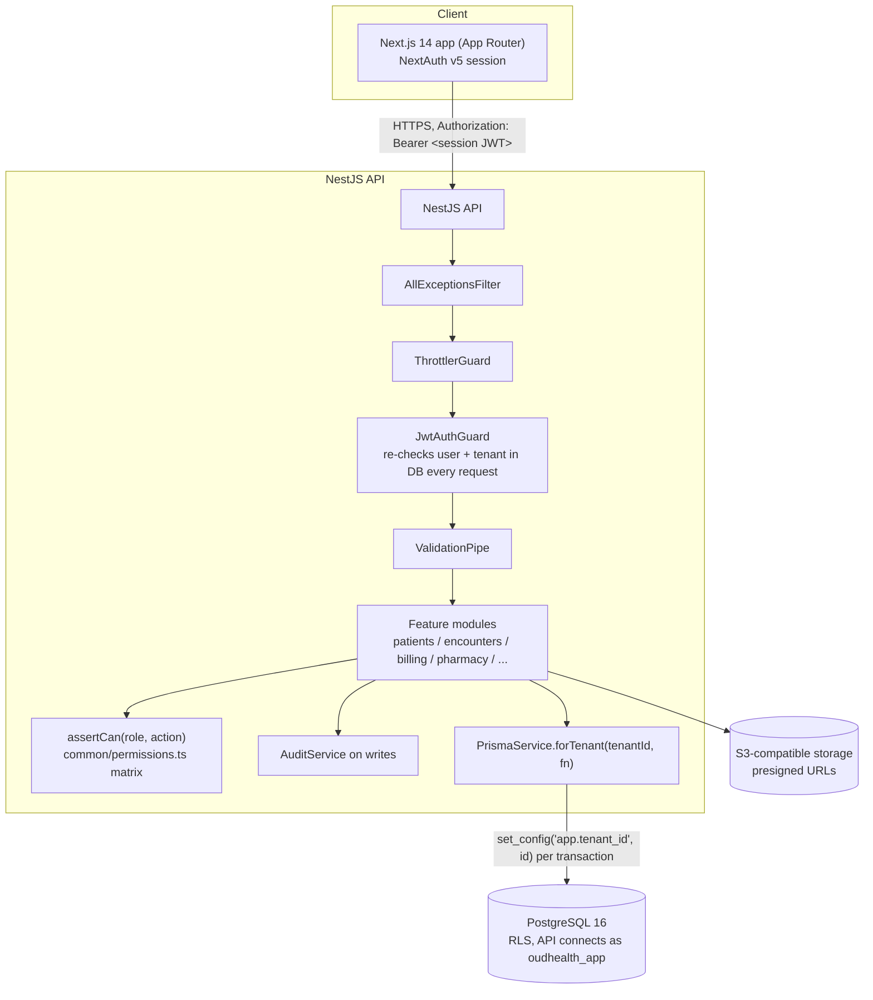

# Architecture

OudHealth is a multi-tenant SaaS. One codebase serves many hospitals; each
hospital's data is isolated by `tenantId` and enforced at the database with
PostgreSQL Row-Level Security (RLS).

## Request flow

## How a request is secured (every call)

1. **AllExceptionsFilter** wraps the whole pipeline: known `HttpException`s pass
   through unchanged, anything else becomes a generic 500 with an `x-request-id`.
2. **ThrottlerGuard** rate-limits (120 req / 60 s, in-memory per instance).
3. **JwtAuthGuard / JwtStrategy** verifies the session token and re-reads the user
   from the database on every request: a deactivated account, a deactivated
   tenant, or a token whose tenant no longer matches is rejected immediately, and
   the role is read fresh so role changes take effect at once.
4. **ValidationPipe** (`whitelist: true, transform: true`) strips unknown fields
   and coerces types against the DTO.
5. **Feature module** runs business logic. Authorization is an action check:
   `assertCan(role, 'patient:read')` against the flat matrix in
   `apps/api/src/common/permissions.ts`. `apps/web/lib/permissions.ts` is an
   identical copy used to hide/disable UI; `permissions.drift.spec.ts` fails the
   build if the two diverge. (`RolesGuard` + `@Roles()` is a second, vestigial
   mechanism kept only on `BillingController`.)
6. **PrismaService.forTenant** opens a transaction and sets `app.tenant_id`; RLS
   policies filter every query by it. Because the API process connects as the
   non-superuser `oudhealth_app` role, RLS cannot be bypassed even if application
   code forgets a `where tenantId` (defense in depth).
7. **AuditService** records who did what, to which entity, when, on writes.

## Identity

Walled garden, no external IdP. Per-tenant `User` (email unique per tenant).
Apex domain (`oudmed.com`) hosts new-hospital sign-up; each hospital works at
`<slug>.oudmed.com`. Sign-up issues a short-lived **pending token** (pre-tenant);
after email verification and tenant creation the user gets a **session token**.
The web app holds the session via NextAuth and forwards it as a bearer token.

## Roles

`SUPER_ADMIN` (bypasses the matrix), `HOSPITAL_ADMIN`, `DOCTOR`, `NURSE`,
`RECEPTIONIST`, `PHARMACIST`, `LAB_STAFF`, `ACCOUNTANT`.

## Module map

`auth`, `tenants`, `directory` (departments, doctors, hours), `schedule`
(outpatient visits), `admissions` (wards, beds, inpatient), `patients` +
`clinical` (chart, complaints, diagnoses, vitals, prescriptions, documents),
`encounters` (the consultation workspace), `pharmacy` (drug inventory +
dispensing), `billing` (invoices, payments, receipts), `claims` (HMO), `reports`,
`storage`/`files` (object storage), `settings`, `home` (role-aware dashboard),
`staff` (HR), `admin` (master data). Cross-cutting: `common/permissions`,
`common/sequence` (gapless `TenantSequence` numbering), `common/audit`,
`common/env.validation`, `common/filters`, `prisma`.

## Data model

Source of truth is [apps/api/prisma/schema.prisma](../apps/api/prisma/schema.prisma).
Every tenant-scoped table carries `tenantId` and has an RLS policy in
[apps/api/prisma/rls.sql](../apps/api/prisma/rls.sql). See [ERD.md](ERD.md) for
the core entities.
