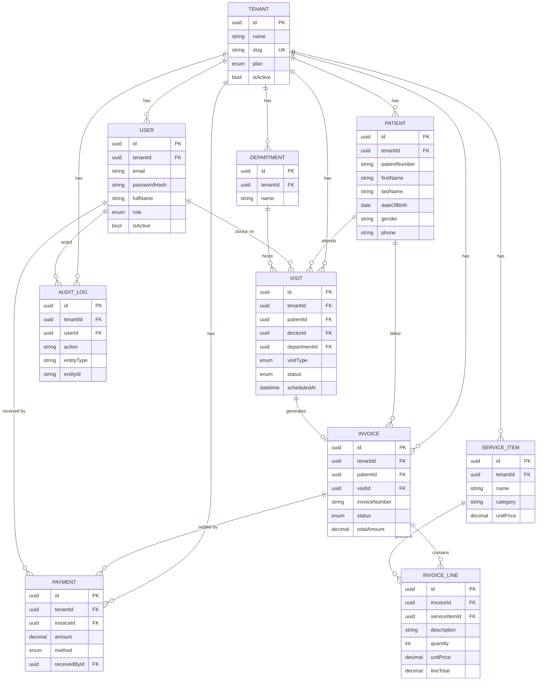

# Database ERD

The authoritative schema is
[apps/api/prisma/schema.prisma](../apps/api/prisma/schema.prisma) (~40 models).
This diagram shows only the **core money-loop entities**; the clinical
(Complaint / Diagnosis / VitalSigns / Prescription / ClinicalNote / ClinicalOrder),
pharmacy (Drug / DrugBatch / StockMovement), admissions (Ward / Bed / Admission),
claims (InsuranceClaim / ClaimBatch / ClaimRemittance), storage (StoredFile) and
`TenantSequence` (gapless invoice / receipt numbering) tables are omitted for
readability.

Every tenant-scoped table carries `tenantId` and has a matching policy in
[apps/api/prisma/rls.sql](../apps/api/prisma/rls.sql). RLS is enforced because the
API connects as a NOSUPERUSER / NOBYPASSRLS role.

