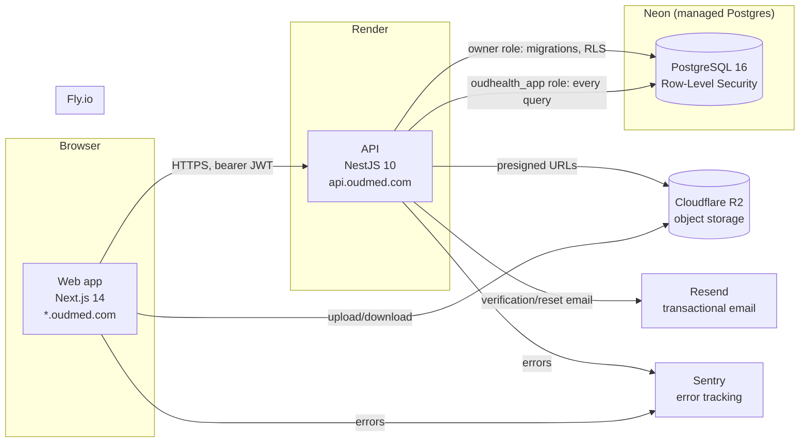
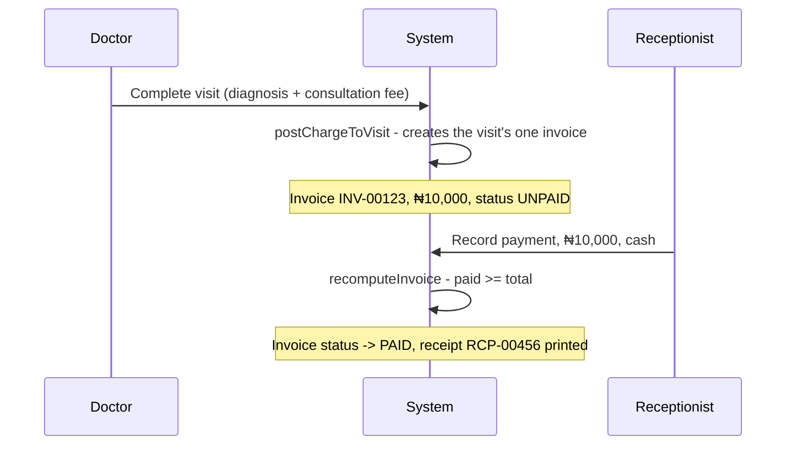
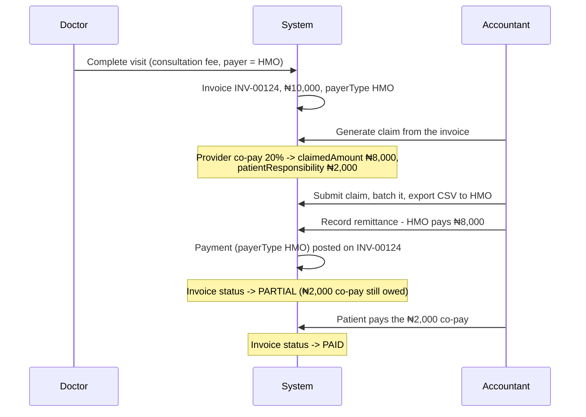
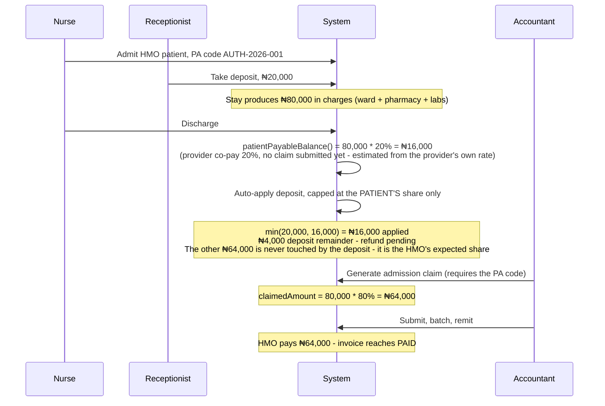

# OudHealth System Guide

A complete walk-through of what OudHealth is and how it actually behaves
today (2026-10-02), written so a non-engineer can follow the plain-language
parts and an engineer can follow the technical detail underneath each
section. This is the authoritative, current description of the system -
`docs/OPERATIONS_GUIDE.md` predates the inpatient (F1) and pay-before-dispense
(F2) work and the platform admin console, and is superseded by this document
where the two disagree.

---

## 1. Overview

**What it is.** OudHealth is software a hospital runs its day-to-day
operations on: registering patients, booking and running appointments,
recording clinical notes, prescribing and dispensing drugs, running labs,
billing patients and insurers, admitting and discharging inpatients, and
reporting on all of it. One OudHealth deployment serves many hospitals at
once - each hospital's staff, patients and money are completely invisible to
every other hospital on the same system.

**Multi-tenancy.** Each hospital ("tenant") gets its own subdomain, e.g.
`stgospel.oudmed.com`. A new hospital signs itself up at the apex domain
(`oudmed.com`), picks a subdomain slug, verifies its first admin's email with
a 6-digit code, and is live. Every database row that belongs to a hospital
carries that hospital's `tenantId`, and PostgreSQL's Row-Level Security
(RLS) enforces at the database layer - not just in application code - that a
query can only ever see rows for the tenant it's currently scoped to. The
API itself connects to the database as a restricted, non-superuser role
specifically so that even a bug in application code (a forgotten tenant
filter) cannot leak one hospital's data into another's response.

**Architecture.**



**Tech stack.** API: NestJS 10, Prisma 5, PostgreSQL 16, JWT auth,
class-validator, Jest (integration tests against a real database). Web:
Next.js 14 App Router, TanStack Query for all server state, Tailwind CSS,
NextAuth v5, Axios. Shared: `packages/contracts` (type-only interfaces both
apps import, so the frontend and backend can never silently disagree on a
shape) and `packages/validation` (Zod schemas the web forms validate
against). Turborepo + pnpm workspaces tie it together.

**Repo structure.**
```
apps/api/           NestJS API - one directory per module (billing, claims,
                     admissions, pharmacy, ...), prisma/ for schema + migrations
apps/web/            Next.js app - app/(protected)/<module>/ per screen,
                     components/<module>/ for its pieces, lib/<module>.ts
                     for its API client + shared constants
packages/contracts/  Shared TypeScript interfaces (DTOs) - type-only, erased
                     at build time, never a runtime dependency
packages/validation/ Zod schemas (currently: patient registration)
packages/config/     Shared tsconfig base
docs/                This guide, deployment runbooks, feature design docs,
                     the audit trail (docs/audit/)
```

---

## 2. Roles and permissions

Eight tenant-bound roles (every `User` belongs to exactly one hospital, even
`SUPER_ADMIN` - see section 3.16 for the separate, genuinely cross-tenant
platform admin console):

| Role | Typical user | Broad scope |
|---|---|---|
| `HOSPITAL_ADMIN` | Owner/manager | Everything within their hospital |
| `DOCTOR` | Physician | Consultations, diagnosis, prescriptions, orders, clinical notes |
| `NURSE` | Nursing staff | Vitals, admissions, bed/ward operations, appointment operations |
| `RECEPTIONIST` | Front desk | Registration, scheduling, check-in, deposits, payments |
| `PHARMACIST` | Pharmacy staff | Drug inventory, dispensing |
| `LAB_STAFF` | Lab/imaging | Worklist, results |
| `ACCOUNTANT` | Finance | Billing, HMO claims, reports |
| `SUPER_ADMIN` | (legacy, tenant-bound) | Bypasses the permission matrix entirely within its own tenant only |

Authorization is checked **twice, and only one of them matters for
security**: the API calls `assertCan(role, action)` - this is the real
boundary, enforced on every request regardless of what the browser shows -
and the web app calls the identical `can(role, action)` purely to hide or
grey out buttons a role can't use. A dedicated test
(`permissions.drift.spec.ts`) fails the build the moment the two copies
disagree, so the UI can never silently promise something the API would
reject.

The full matrix (`apps/api/src/common/permissions.ts`), 42 actions as of
this writing:

| Area | Action | Allowed roles |
|---|---|---|
| Appointments | `book` / `edit` / `cancel` | Receptionist, Nurse, Doctor, Hospital Admin |
| Appointments | `check-in` / `no-show` / `reschedule` / `reopen` | Receptionist, Nurse, Hospital Admin |
| Appointments | `start` / `complete` | Doctor, Nurse, Hospital Admin |
| Admissions | `create` / `edit` / `discharge` | Doctor, Nurse, Hospital Admin (transfer: Nurse, Hospital Admin only) |
| Admissions | `deposit` | Receptionist, Accountant, Hospital Admin |
| Admissions | `deposit-refund` / `discharge-unsettled` | Accountant, Hospital Admin (discharge-unsettled: Hospital Admin only) |
| Admissions | `reopen` | Doctor, Hospital Admin |
| Wards/beds | `ward:manage` | Hospital Admin only |
| Wards/beds | `bed:set-status` | Nurse, Hospital Admin |
| Patients | `register` / `read` / `edit` / `document` | Receptionist, Nurse, Doctor, Hospital Admin |
| Clinical | `complaint:record` | Receptionist, Nurse, Doctor, Hospital Admin |
| Clinical | `vitals:record` | Nurse, Doctor, Hospital Admin |
| Clinical | `diagnosis:record` / `prescription:write` / `note:write` / `order:create` | Doctor, Hospital Admin |
| Clinical | `order:result` | Lab Staff, Doctor, Hospital Admin |
| Clinical | `visit:reopen` | Doctor, Hospital Admin |
| Pharmacy | `prescription:dispense` / `pharmacy:manage` | Pharmacist, Hospital Admin |
| Pharmacy | `pharmacy:dispense-emergency-override` | Pharmacist, Hospital Admin |
| Billing | `invoice:pay` / `billing:manage` | Receptionist, Accountant, Hospital Admin |
| Claims | `claims:manage` | Hospital Admin, Accountant |
| Claims | `claims:generate-without-pa` | Hospital Admin only |
| Reports | `reports:view` | Hospital Admin, Accountant |
| Admin | `staff:manage` / `admin:settings` / `doctor:set-hours` | Hospital Admin only |

Notably, `patient:read` deliberately excludes Pharmacist, Lab Staff and
Accountant - their work is served by dedicated queues (the dispensing
queue, the lab worklist, the invoice list) carrying only the minimal
identifiers each needs, not the full clinical chart.

---

## 3. Every module

### 3.1 Registration

**Purpose.** Create and maintain the patient record every other module
hangs off.

**Flow.** An 8-step wizard (`/patients/new`): demographics, contact, next of
kin, payer/insurance, clinical background (allergies, chronic conditions,
blood group), ID document, photo, consent, review. The record is actually
created in the database as soon as step 2 completes - a `patientNumber` is
assigned immediately (`PT-00001`, sequential, gapless, tenant-scoped) - so
the wizard is resumable later at `/patients/new?id=<id>` if someone closes
the tab partway through. The dedupe step searches existing patients by
name/phone/DOB before letting registration proceed, and now (since this
session's feedback pass) tells the user plainly if that check itself failed
to run, rather than silently reading as "no duplicate found."

**Statuses.** `registrationStatus`: a patient record exists in a partial
state until all 8 steps are done, then `COMPLETE`.

**Who can.** `patient:register` - Receptionist, Nurse, Doctor, Hospital
Admin.

**Edge cases.** Quick-add (a minimal single-screen alternative for a walk-in
with no time for the full wizard) creates a bare record a staff member can
flesh out later. A patient's clinical history, photo, and documents can all
be edited after registration from the patient chart.

### 3.2 Scheduling

**Purpose.** Book, track and run appointments.

**Flow.** `/schedule` - book a patient against a doctor/department/time
slot; the day's board shows every appointment by status. Checking in, starting
the consultation, and completing it are each their own explicit action, not
implicit from time passing.

**Statuses (`VisitStatus`):**
```
SCHEDULED -> CHECKED_IN -> IN_PROGRESS -> COMPLETED
     |            |             |
     +--> CANCELLED / NO_SHOW <-+   (reversible to SCHEDULED via "reopen")
```
Each arrow is its own permission (`appointment:check-in`,
`appointment:start`, etc.) - a receptionist can check a patient in but only
a doctor/nurse can mark the visit `IN_PROGRESS`.

**Who can.** See the table in section 2.

**Edge cases.** A doctor double-booked in the same slot, or a booking
outside a doctor's configured working hours, is blocked with a specific
error unless explicitly forced through (both surfaced as named error codes
the UI turns into a clear message, not a generic failure). `visit:reopen`
lifts the completed-visit clinical lock for a bounded late correction
(FUNC-2) without pretending the visit never happened - see 3.3.

### 3.3 Encounters (the consultation workspace)

**Purpose.** Everything a doctor does during one visit, in one screen.

**Flow.** `/encounters/[visitId]` - presenting complaint, vitals review,
diagnosis, prescription (autocompletes from the live pharmacy catalogue),
lab/imaging orders, a SOAP clinical note. "Complete visit" closes the
encounter and is also the trigger that finalizes the visit's invoice (see
3.9).

**Statuses.** Tied to the parent visit's `VisitStatus`. Once `COMPLETED`,
new clinical entries are blocked unless the visit is explicitly reopened
(`visit:reopen` - gated further to the visit's own attending/admitting
doctor, or any Hospital Admin); a note can still gain a dated *addendum*
after completion without touching the original text, which is the
correct way to add a late result or correction without altering the
historical record.

**Who can.** Doctor for diagnosis/prescription/notes/orders; Nurse also for
vitals and complaints; see section 2 for the full breakdown.

**Edge cases.** Reopening a visit whose invoice is already paid or claimed
never edits that locked invoice - a late charge lands on a new
**supplementary invoice** for the same visit instead (the same mechanism
admissions use, section 3.11).

### 3.4 Clinical notes and addenda

**Purpose.** The SOAP note (subjective/objective/assessment/plan) is the
doctor's narrative record of the encounter.

**Flow.** One upsertable note per visit while it's open; once the visit
completes, the note is frozen and any further detail is a separate,
timestamped, authored addendum rather than an edit - so the record of what
was known and when is never silently rewritten.

**Who can.** `note:write` - Doctor, Hospital Admin.

An admission's ward-round notes work differently from a visit's single note
- see 3.11.

### 3.5 Vitals

**Purpose.** Temperature, pulse, blood pressure, SpO2, weight, height,
glucose, etc., with basic clinical range flagging (e.g. a very high/low
reading highlighted on the chart).

**Flow.** Recorded from the encounter workspace or directly on the patient
chart; every reading is timestamped and attributed.

**Who can.** `vitals:record` - Nurse, Doctor, Hospital Admin.

### 3.6 Diagnosis

**Purpose.** The clinical diagnosis attached to a visit (or admission),
with a certainty level and, where relevant, an ICD-style code.

**Who can.** `diagnosis:record` - Doctor, Hospital Admin.

### 3.7 Prescriptions and off-formulary

**Purpose.** What a doctor orders a patient to take, which the pharmacy
then dispenses against.

**Flow.** Written from the encounter (or admission) workspace, one or more
items per prescription, each either a real formulary drug (autocompleted
from the catalogue, price locked to the catalogue) or an off-formulary
free-text item (not in the catalogue - requires a reason, never affects
stock, and is tracked in its own off-formulary report so an admin can see
which non-catalogue drugs come up often enough to formally add).

**Statuses.** `PrescriptionStatus`: `ACTIVE -> COMPLETED` (fully dispensed)
or `CANCELLED`. Per-item `DispenseStatus`: `PENDING -> PARTIAL -> DISPENSED`,
plus `AWAITING_PAYMENT` when the pay-before-dispense gate is on (3.8) and
`CANCELLED`.

**Who can write.** `prescription:write` - Doctor, Hospital Admin.
**Who can dispense.** `prescription:dispense` - Pharmacist, Hospital Admin.

### 3.8 Pharmacy

**Purpose.** Drug inventory and dispensing, with real stock integrity and
price integrity - a catalogue price is authoritative, and dispensing a
drug nobody can actually hand over is never silently allowed.

**Inventory.** `/pharmacy` Inventory tab: drug catalogue (SKU, generic
name, form, strength, sell price, reorder level), batches per drug (each
with its own expiry date and quantity), CSV bulk import, per-drug usage
charts, and a stock-movement log. Stock draws **FEFO** (first-expiry-first-out)
- dispensing always consumes the soonest-to-expire batch with real stock
left, never an arbitrary one, and a batch is treated as expired from the
start of its printed expiry date in Africa/Lagos time, not merely "has the
exact instant passed."

**Dispensing, gate off (default).** `/pharmacy` Dispensing tab - the queue
of active prescriptions; confirming a dispense decrements stock and posts
the charge in one atomic step. Insufficient stock is a clear 409 (naming
whether it's genuinely out of stock, has only expired stock left, or just
doesn't have *enough* unexpired stock), never a silent partial dispense.

**Dispensing, gate on (`requirePaymentBeforeDispense`, per-hospital
setting, Settings > Pharmacy).** A cash or HMO co-pay charge is *prepared*
(charged, posted to the invoice) but held back from stock until that
invoice reaches `PAID`; the pharmacist then *releases* it, which is the
point stock actually moves. Three things still dispense immediately
regardless of the setting: a fully HMO-covered item (0% co-pay), a
currently admitted patient's charges (an admission's bill is settled in
aggregate at discharge, not item-by-item), and a flagged, audited
**emergency override** (`pharmacy:dispense-emergency-override` - Pharmacist
or Hospital Admin, with a mandatory reason, reviewable afterward in a
dedicated overrides report). A co-pay item's quantity itself splits
proportionally: at 30% co-pay, a quantity of 10 becomes 7 dispensed
immediately (the HMO-covered share) and 3 held until the patient's own
30% is paid - both are independently traceable to their own invoice line.
If the patient never pays, the held preparation can be cancelled (reason
required, audited) - the charge is voided and nothing was ever drawn from
stock, since stock only ever moves at release.

**Who can.** `prescription:dispense` / `pharmacy:manage` - Pharmacist,
Hospital Admin.

### 3.9 Billing

**Purpose.** The money side of outpatient care.

**Flow.** Exactly one invoice per visit, created automatically the first
time anything billable is posted to it (a diagnosis fee, a prescription, an
order, or the act of completing the visit) - never created manually for a
real visit, though an ad-hoc invoice can be built from the service
catalogue directly at `/billing/new` for something outside a visit
entirely. Recording a payment issues a printable receipt
(`RCP-000001`-style, sequential and gapless); a payment can be reversed
(reason required) and the invoice recomputes. Every manual line edit -
adding a missed charge, overriding a catalogue price, removing a line - is
audited with who/when/before/after, and a price override or a removal
specifically requires a typed reason (a plain catalogue-priced addition
does not).

**Supplementary invoices.** Once an invoice has a live payment or an
insurance claim on it, it is locked - never silently edited further. The
*next* charge for that same visit automatically opens a **supplementary**
invoice instead, so billing continuity survives a mid-visit payment or
claim without losing or misrouting a later charge.

**Statuses (`InvoiceStatus`).** `UNPAID -> PARTIAL -> PAID`, or `CANCELLED`
from any pre-paid state (reason required, logged).

**Who can.** `invoice:pay` / `billing:manage` - Receptionist, Accountant,
Hospital Admin.

### 3.10 HMO claims

**Purpose.** Recovering the HMO-covered portion of a bill from the
insurer.

**Flow.** `/claims` - generate a claim from an eligible HMO-payer invoice
(outpatient) or a discharged admission (inpatient, 3.11), each claim's
lines carrying the claimed amount at the provider's configured co-pay
split; submit it; batch several claims per provider into one schedule;
export that schedule as a CSV to send the HMO. When the HMO remits, record
the remittance - allocate approved/paid/shortfall across the batch's
claims, which posts real `Payment` rows onto the underlying invoice(s). A
shortfall can be written off (posts a negative "HMO Adjustment" line) or
left to grow the patient's own payable balance. `/reports` and `/claims`
both surface a receivables-aging view across every open claim.

**Admission claims (multi-invoice).** Unlike an outpatient claim (always
exactly one invoice), an admission's stay can span a primary invoice plus
one or more supplementary ones; one claim is generated spanning all of
them, and a remittance or write-off against that claim splits
proportionally across every invoice it actually touches - not just the
first one. See section 4's worked example.

**Pre-authorization codes.** Required by default before an admission claim
can be generated - a Hospital Admin can override this with a reason
(`claims:generate-without-pa`, audited), and a PA-overridden claim is
flagged "No PA code" everywhere it's shown, including the payer-facing
batch export, rather than left blank.

**Statuses.** Claim: `DRAFT -> SUBMITTED -> PART_PAID/PAID`, or
`REJECTED`/`WRITTEN_OFF`/`CANCELLED`. Batch: `OPEN -> SUBMITTED ->
RECONCILED -> CLOSED`.

**Who can.** `claims:manage` - Hospital Admin, Accountant.
`claims:generate-without-pa` - Hospital Admin only.

### 3.11 Inpatient (admissions)

**Purpose.** The full admit-to-discharge lifecycle, with its own running
bill, deposits, and bed-day charges - this is the largest single module in
the system (F1a through F1d).

**Admit.** From a patient's chart or the ward board: pick a ward and an
available bed, admission type (elective/emergency), optionally the payer
details (HMO name, pre-auth code). The bed flips to `OCCUPIED` immediately.

**Deposits.** A cash deposit can be taken at any point during the stay
(receipt issued, its own ledger entry - never counted as revenue until it
is actually applied against a real charge). At discharge, any remaining
credit is auto-applied against what the patient still owes, capped at the
**patient-payable portion only** - never at an amount the HMO is expected
to cover (see section 4's inpatient-HMO example for exactly how that split
is determined). If credit is left over after that, discharge still
completes immediately rather than blocking on it - the remainder is
recorded as a **pending refund**, visible on the admission and on a
tenant-wide "Refunds due" list for billing/cashier staff, and paid out
later with its own receipt and cash-ledger entry.

**Bed-day charges.** A nightly job (00:05 Africa/Lagos) posts one charge per
night stayed, at whichever ward's rate was active that night (a mid-stay
transfer correctly attributes each night to the right ward). Two
configurable rules govern how a partial day counts (`MIDNIGHT_CENSUS` -
one charge for every Lagos midnight the patient is still admitted, or
`ROLLING_24H` - one charge per full-or-partial 24-hour block from
admission time), and a separate setting governs what a stay that never
crosses a midnight at all costs (free, one full night's rate, or a
cheaper day-case rate). The job is safe against being skipped a night (a
sleeping free-tier instance, a restart) - any missed night is caught up
automatically at the next run or at discharge, before the final bill is
computed, so no charge is ever lost; it is also safe against running
twice at once (an advisory lock plus a database uniqueness constraint
make a duplicate attempt's entire transaction roll back cleanly).

**Interim and final bills.** `GET /admissions/:id/bill` - admission info,
every invoice the stay has produced, deposits (with refund status),
running totals - printable at any time, labelled "Interim bill - stay in
progress" until discharge, "Final bill" after.

**Discharge.** A settlement setting (`requireSettledBillAtDischarge`, off
by default) can require the patient's own payable balance to be zero
before a non-admin can discharge; a Hospital Admin can always override
with a reason (audited). Discharge never silently fails on a deposit
refund being due (see Deposits above) - it is the one thing that is
genuinely allowed to be settled after the fact.

**Reopen.** After discharge, `admission:reopen` lifts the clinical guard
for a bounded late correction (a late lab result, a note needing
amending) without reverting the discharge status or re-occupying the bed; a
resulting late charge lands on a new supplementary invoice, since the
discharge-time invoices are already locked.

**Statuses (`AdmissionStatus`).** `ADMITTED -> DISCHARGED` (or
`TRANSFERRED_OUT`, `DECEASED`, `ABSCONDED`, each terminal, reached via the
same discharge-style form).

**Who can.** See section 2's Admissions rows - broadly Doctor/Nurse/Hospital
Admin for the clinical lifecycle, Receptionist/Accountant/Hospital Admin
for deposits, Accountant/Hospital Admin for refunds, Hospital Admin alone
for an unsettled-balance override.

### 3.12 Reports

**Purpose.** Financial and operational visibility across a date range.

**Flow.** `/reports` - finance KPIs (total collection, insurance collected,
discounts, deposits held, refunds owed, inpatient revenue as a visible
subset of total revenue), operational KPIs (patients, appointments, active
doctors, attendance rate), collections-over-time and patient-trend charts,
revenue by department/doctor, appointments by weekday, bed occupancy by
ward (live, not windowed by the report's date range), an admissions trend,
and a filterable, CSV-exportable payment ledger that also lists deposits
and deposit refunds as their own clearly-tagged cash entries (never
counted as revenue).

**Who can.** `reports:view` - Hospital Admin, Accountant.

### 3.13 Settings and administration

**Purpose.** Hospital-level configuration.

**Settings** (`/settings`): hospital profile, branding (logo, brand
color - themed per tenant), invoice/receipt number prefixes, the inpatient
charge rule and short-stay mode, the settle-at-discharge toggle, and the
pay-before-dispense toggle.

**Administration** (`/admin`): the master data every other module depends
on - Services (the billing catalogue, with prices), Departments, Insurance
providers (name, co-pay percentage, used throughout registration/billing/
claims). Deletes are guarded when a record is actually in use (an IN_USE
error suggests deactivating instead), and every change is audited.

**Who can.** `admin:settings` - Hospital Admin only.

### 3.14 HR

**Purpose.** Staff accounts and department assignment.

**Flow.** `/hr` - add a staff member (the admin sets an initial password
directly - there is no invite-email flow), assign them to one or more
departments, deactivate/reactivate (guarded against deactivating yourself
or the last remaining admin), reset a password. A doctor's weekly working
hours are configured here too, feeding the scheduling clash checks in 3.2.

**Who can.** `staff:manage` - Hospital Admin only.

### 3.15 Reports, settings, HR permissions recap

All three above are Hospital-Admin-only except reports (which Accountant
also sees) - deliberately narrow, since they touch configuration or other
staff's accounts rather than day-to-day clinical/financial work.

### 3.16 Platform / Super Admin

**Purpose.** OudHealth's own team operating the platform itself - entirely
separate from any hospital's own `HOSPITAL_ADMIN`/`SUPER_ADMIN` accounts.

**What it is.** A genuinely cross-tenant identity (`PlatformUser` - no
`tenantId` at all, unlike every other role in the system) behind its own
login and guard (`PlatformAuthGuard`), reachable only at its own routes,
never through a hospital's subdomain session.

**Flow.** List/search every hospital on the platform, view its
subscription status, suspend or reactivate one (suspension blocks every
one of that hospital's staff from logging in, with a plain "Account
suspended" screen rather than a confusing generic error), manually confirm
a bank-transfer subscription payment, manage other platform-operator
accounts, and a platform-wide audit log of every one of these actions
(`PlatformAuditLog` - also not tenant-scoped, since it is itself a global
record, not something any one hospital should ever be able to read).

**Who can.** Anyone issued a `PlatformUser` account - there is no
role tiering within the platform console today.

---

## 4. Money flows end to end

Every example below uses the HMO co-pay convention this codebase uses
throughout: `defaultCoPayPct` is **the patient's own share**. A provider
configured at 20% means the HMO covers 80% and the patient covers 20% -
`claimedAmount = gross * (1 - coPayPct / 100)`.

### 4.1 Outpatient, cash patient



**Worked example.** Consultation fee ₦10,000. Invoice `INV-00123` is
created the moment the visit is completed, `status: UNPAID`,
`totalAmount: 10,000`. The patient pays the full ₦10,000 in cash at the
front desk; the invoice recomputes to `PAID`, and a sequential receipt
(`RCP-00456`) prints.

### 4.2 Outpatient, HMO patient



**Worked example.** Same ₦10,000 consultation, this time an HMO patient
whose provider has a 20% co-pay configured. A claim is generated:
`claimedAmount = 10,000 * (1 - 20/100) = 8,000`, `patientResponsibility =
2,000`. The claim is submitted and batched; when the HMO remits ₦8,000, a
`Payment` (tagged `payerType: HMO`) posts onto the invoice, which becomes
`PARTIAL` (not `PAID` - the patient's own ₦2,000 is still outstanding).
Once the patient pays that ₦2,000 separately, the invoice reaches `PAID`.

### 4.3 Inpatient, cash patient with a deposit

```mermaid
sequenceDiagram
    participant N as Nurse
    participant R as Receptionist
    participant S as System
    N->>S: Admit patient to Ward A, Bed 3
    R->>S: Take deposit, ₦50,000
    Note over S: Receipt issued; deposit NOT counted as revenue yet
    loop Each night (cron, 00:05 Africa/Lagos)
        S->>S: Post one bed-day charge at Ward A's rate (₦15,000/night)
    end
    Note over S: 3 nights stayed -> ₦45,000 charged across the stay
    N->>S: Discharge
    S->>S: Auto-apply deposit against the balance, capped at ₦45,000
    Note over S: ₦45,000 of the ₦50,000 deposit applied as a real Payment<br/>₦5,000 remains - refunded immediately or recorded pending
```

**Worked example.** Ward A's daily rate is ₦15,000. A deposit of ₦50,000
is taken at admission (receipt issued, not yet revenue). The patient stays
3 nights; the nightly job posts 3 bed-day charges totalling ₦45,000. At
discharge, the deposit is auto-applied: `toApply = min(available deposit,
amount owed) = min(50,000, 45,000) = 45,000` - this becomes a real
`Payment`, and the invoice reaches `PAID`. The remaining ₦5,000 of deposit
credit is either refunded immediately (if the discharging staff member
supplies a refund method on the same action) or recorded as a **pending
refund** - discharge completes either way, never blocked on this.

### 4.4 Inpatient, HMO patient with a pre-authorization code

This is the one that most needs spelling out, because the deposit must
never be used to prepay money the HMO is expected to cover.



**How the patient/HMO split is determined, today, in order:** (1) if a
claim already exists for the admission, the patient's share is whatever
the claim has not yet recovered (`claimedAmount - paidAmount -
writeOffAmount`, zero once the claim resolves to `PAID`/`REJECTED`/
`WRITTEN_OFF`/`CANCELLED`); (2) with no claim yet, it's estimated from the
linked `InsuranceProvider.defaultCoPayPct` - the same primitive the claim
itself will use once generated. Either way, a deposit (and the auto-apply
step at discharge) can never draw against more than this patient-payable
figure - the HMO's expected portion is never prepaid out of patient money.

**If the HMO later rejects part of the claim:** say ₦10,000 of the
₦64,000 claimed is rejected outright rather than paid. The patient's
payable share grows by exactly that ₦10,000 on the next read (it's
computed live from the claim's own numbers, never cached) - a deposit
still held (if any remains unapplied/unrefunded), or a fresh payment, can
then cover the difference. Nothing about this requires reopening the
admission or manually recalculating anything by hand.

### 4.5 The HMO handshake - what's automated vs. manual

| Step | Automated today | Manual today |
|---|---|---|
| Resolving the patient's co-pay split | Yes - from the linked `InsuranceProvider` | - |
| Generating a claim (outpatient or admission) | Yes - pools the eligible invoice(s), applies the co-pay factor | Choosing *which* invoices/admissions to claim |
| Batching claims per provider | Yes | Deciding the batch period/grouping |
| Sending the claim schedule to the HMO | CSV export generated | Actually emailing/uploading it to the HMO's own portal - outside this system entirely |
| Receiving the HMO's adjudication/remittance | - | Reading the HMO's own remittance advice and typing the approved/paid/shortfall figures in |
| Posting the remittance as real payments | Yes, once typed in - splits correctly across every invoice a multi-invoice admission claim touches | - |
| Chasing a rejected/shortfall amount | Aging/receivables visibility | Deciding to write off, bill the patient, or appeal - outside this system |

In short: OudHealth does the arithmetic and the bookkeeping on both sides
of the handshake; the actual back-and-forth with the HMO (submitting the
schedule, receiving their decision) happens outside the system today, the
same way most Nigerian hospitals' HMO relationships work in practice.

---

## 5. Security and data protection

- **Tenant isolation.** PostgreSQL Row-Level Security, enforced because the
  API connects as a non-superuser, `NOBYPASSRLS` role
  (`oudhealth_app`/`APP_DATABASE_URL`). Proven by an automated cross-tenant
  test (`rls.int-spec.ts`) that attempts a real cross-tenant read and
  confirms it returns nothing.
- **Authentication.** Per-tenant credentials (bcrypt), JWT session tokens,
  mandatory email verification (a 6-digit code, not a magic link) before
  first login, a short-lived pending token during sign-up, and a one-time
  ticket handoff from pending to a full session.
- **Authorization.** `assertCan(role, action)` server-side is the real
  boundary; every request re-reads the user from the database (not just
  the JWT's claims), so a deactivated account or a changed role takes
  effect on the very next request, not merely at next login.
- **Audit trail.** `AuditService.record(...)` appends an immutable row for
  writes across essentially every module - staff, billing, claims,
  patients, pharmacy, admissions, wards, settings, storage, auth events
  (login success/failure, unverified-login-blocked, password reset) - plus
  a fully separate `PlatformAuditLog` for platform-operator actions, which
  carries no tenant at all.
- **File uploads.** Magic-byte validated on upload (not just trusting the
  claimed content type), optional malware scanning (clamd, opt-in),
  served only via short-lived presigned URLs minted on click (never a
  durable URL embedded in a list response), with an orphan-file sweeper.
- **Rate limiting.** `@nestjs/throttler` on every auth endpoint.
  **Known limitation**: in-memory per instance - fine for a single-instance
  deployment, needs a shared store before horizontal scaling.
- **Error tracking.** Sentry on both API and web, with `sendDefaultPii:
  false` and a `beforeSend` hook that strips personal data and tags only
  tenant/user/role - a stack trace never carries a patient's name or
  clinical detail.
- **Backups.** Point-in-time restore via the managed Postgres provider
  (Neon); see `docs/DEPLOYMENT.md` section 8 for the drill procedure and
  `docs/OPERATIONS_GUIDE.md` for the full restore runbook.

---

## 6. Operations

See `docs/DEPLOYMENT.md` for the full production runbook (environment
variables, Fly/Render setup, first-run setup, backups, go-live checklist,
rollback) and `docs/OPERATIONS_GUIDE.md` for local development, the
verify-before-finishing checklist, and the disaster-recovery drill
procedure in detail. In summary: web on Fly.io (always-on, no sleep), API
on Render (`starter` plan or above, so the nightly bed-charge and
subscription-renewal cron jobs fire reliably), database on Neon
(production and staging as separate projects), object storage on
Cloudflare R2, transactional email via Resend, error tracking via Sentry.
Every API boot re-applies migrations and RLS policies (both idempotent) via
`docker-entrypoint.sh` before the process starts serving traffic.

---

## 7. Known limitations (v1)

- No distributed rate limiting (in-memory, per API instance) - fine for a
  single-instance pilot, needed before horizontal scaling.
- No automated frontend (web) test suite - web-side correctness is
  verified by strict TypeScript, real builds, and manual click-through, not
  an automated UI test.
- `JWT_SECRET` has no rotation mechanism that avoids a mass logout.
- The HMO handshake's actual submission/adjudication exchange happens
  outside the system (section 4.5) - there is no direct HMO portal/API
  integration today.
- F3 (bulk patient import) is not built - patients are registered one at a
  time through the wizard or quick-add.
- See `docs/audit/WHATS_LEFT.md` for the full prioritised list, including
  severity, risk, and workarounds for everything not yet addressed.
